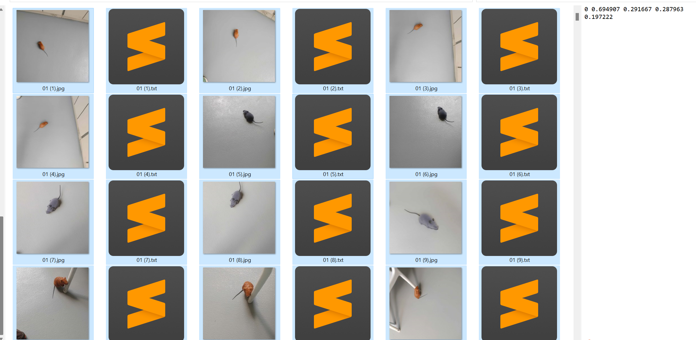

# Public-Health-Onlien-Reporting-and-Rat-AI-Detection-System

The reporting system is my IVE Final Year Project, completed by four students. 

I am responsible for both the web system and AI system. 

The source code on this page pertains to the web component of the reporting system."

## Android System

The android part  of the System [Link to Android System GitHub](https://github.com/210098976/fyp_api)

## Rat AI Detection System

This AI system  aims to count the number of rats in the vidoe of an area monitored in given area and determine the peak activity period of mouse, helping the government to plan ahead for an action plan like mouse hunting.

Taking into account practical limitations, we use the rat toy to conduct out AI Detection tasks.

### Custom Datasets

In order to create more appropriate image dataset for rat toy , four of us people had taken 1000 pictures of the toy rats and label the pictures:

### Train data with Darknet

Darknet: Under this Training tutorial [Colab Link](https://colab.research.google.com/drive/1ANp6uXnUjbU1TNxncPqkGMPDT7PQr2uf#scrollTo=YQUDXrhJekxl), we build YOLOv4 Model through using the Darkset to train model for 5K iterations.

### Running the Tracker with YOLOv4

By using the [YOLOv4](https://github.com/Vincentorium/yolov4-deepsort.git), we generate the resulting video as follow:

